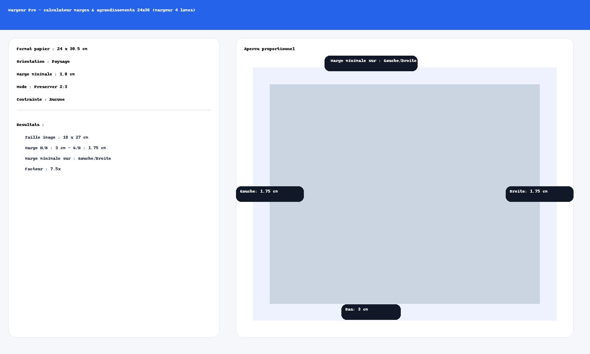

# 📐 Margeur Pro

**Margeur Pro** est une application web gratuite permettant de **calculer et visualiser les marges d’agrandissements à partir de négatifs 24 × 36 mm** sur papiers photo standards, en utilisant un **margeur 4 lames**.  
Elle est conçue pour fonctionner sur ordinateur et smartphone, y compris **hors connexion** grâce au support PWA.



👉 [**Essayer en ligne**](https://alainreichling.github.io/margeur-pro/)  
👉 (Option test : ajouter `?tests=on` à l’URL pour afficher les outils de développement)

---

## ✨ Fonctionnalités principales

- 📏 **Calcul automatique** de la taille d’image et des marges :
  - Mode **Préserver 2:3** → l’application choisit automatiquement si la **marge minimale** s’applique en **haut/bas** ou **gauche/droite** pour maximiser l’image.
  - Mode **Bordures identiques** → marges fixes, recadrage possible.
- 📐 **Aperçu proportionnel** visuel avec valeurs à régler sur le margeur 4 lames.
- 🌐 **PWA installable** sur Android / iOS / desktop, utilisable sans connexion.
- 🧪 Mode **“Tests rapides”** optionnel (`?tests=on`) avec presets courants et génération aléatoire.
- 🧼 Bouton **Purger le cache** pour forcer les mises à jour.

---

## 📲 Installation (PWA)

1. Ouvrir [l’application en ligne](https://alainreichling.github.io/margeur-pro/) depuis Chrome ou Safari.
2. 📌 Android : menu ⋮ → **Ajouter à l’écran d’accueil** → Installer  
   📌 iOS : bouton **Partager** → **Sur l’écran d’accueil**
3. L’appli fonctionne ensuite comme une app native, même hors ligne.

---

## 🧪 Mode tests (`?tests=on`)

L’application comporte des outils cachés pour valider les calculs :

- **URL standard** → outils masqués (mode public).
- **URL avec `?tests=on`** → outils visibles :
  - **Presets rapides** (formats papier classiques, marges fines ou larges, tirages contact…)
  - **Cas aléatoire** pour stress-tester la logique de marges.
  
👉 Exemple :  
```
https://alainreichling.github.io/margeur-pro/index.html?tests=on
```

---

## 📂 Structure du projet

```
/
├── index.html                # Application principale
├── manifest.webmanifest      # Manifest PWA
├── service-worker.js         # Service worker (network-first)
├── icons/                    # Icônes PWA
│   ├── icon-192.png
│   ├── icon-512.png
│   └── icon-maskable.png
├── screenshot.png            # Captures d’écran d’illustration
└── README.md                 # Ce fichier
```

---

## 🚀 Déploiement sur GitHub Pages

1. Créer un dépôt `margeur-pro` (public).  
2. Pousser tous les fichiers (`index.html`, manifest, service-worker, icons, README).  
3. Dans les **Settings → Pages**, choisir la branche `main` et dossier `/ (root)`.  
4. L’application est accessible à :  
   ```
   https://alainreichling.github.io/margeur-pro/
   ```

En cas de mise à jour importante :  
→ ouvrir **À propos → Purger le cache** pour forcer le rechargement de la dernière version.

---

## 📌 À propos

- **Nom** : Margeur Pro  
- **Auteur** : A. Reichling  
- **Version** : 1.1.0 (v6.9.1)  
- **Licence** : Usage libre (non commercial)  
- **Technos** : HTML, CSS, JavaScript (vanilla) + PWA

---

## 📝 TODO / idées futures

- ✍️ Marges asymétriques (ex. marge basse > marge haute pour signature)  
- 🧾 Export PDF ou image des plans de marge pour archivage labo  
- 📦 Mode multi-tirages (tableau comparatif)  
- 🌐 Localisation (EN, DE…)  

---

## 📜 Licence

Usage libre à titre personnel et non commercial.  
Merci de citer l’auteur ou le dépôt en cas de réutilisation ou adaptation.
